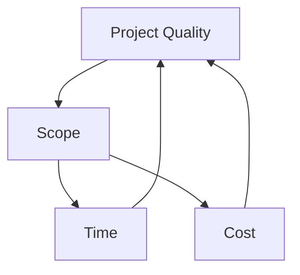
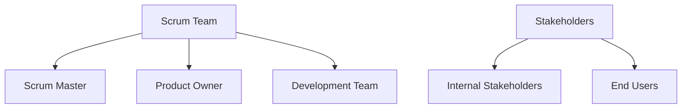

# Agile Principles and Mindset

## Project Quality Factors

In project management, three key factors influence the quality of a project:

1. Cost
2. Time
3. Scope

Among these, **scope** is the most critical factor as it directly impacts both time and cost. The scope defines the boundaries of the project, including its features, functions, and deliverables.

### Importance of Scope

- Scope determines the project's complexity and scale
- It influences resource allocation and timeline estimations
- Changes in scope can significantly affect both cost and time

For example, when developing an application like Uber, the scope would determine whether it's for a single country or multiple countries, which would greatly impact development time and costs.

This is why business consultants prioritize identifying and defining the project scope as their first task. A well-defined scope sets clear expectations and provides a foundation for accurate time and cost estimations.

## Agile Implementation Methods

While Agile is a mindset with core values and principles, there are several methods to implement Agile in practice:

1. Scrum
2. Kanban
3. Extreme Programming (XP)
4. Lean

Among these, **Scrum** and **Kanban** are the most commonly used, with Scrum being the most prevalent.

### Scrum Overview

Scrum is a framework within the Agile methodology that emphasizes collaboration, flexibility, and rapid delivery. Here's an overview of key Scrum components:

#### Scrum Team Roles

1. **Scrum Master**: Acts as a project manager and facilitator for the team.
2. **Product Owner**: Represents the customer's interests and manages the product backlog.
3. **Development Team**: Includes developers and testers responsible for delivering the product increments.

#### Product Backlog

The Product Owner is responsible for maintaining the product backlog, which includes:

- Epics (large bodies of work)
- Features (components of epics)
- User Stories (specific functionalities from a user's perspective)
- Tasks (smaller units of work derived from user stories)
- Bugs (issues identified during testing)

#### Scrum Workflow

1. The Product Owner defines the product vision and creates the initial product backlog.
2. The team breaks down user stories into tasks.
3. Developers implement the tasks and deploy to the testing environment.
4. Testers identify bugs, which are added to the user story for developers to fix.
5. The Product Owner sets release dates and content based on priority, dependencies, and risks.
6. The Product Owner accepts or rejects developed features based on their business understanding and technical knowledge.

#### Sprint Planning and Execution

- The team works in time-boxed iterations called sprints (usually 2-4 weeks).
- At the start of each sprint, the team selects items from the product backlog to work on.
- Daily stand-up meetings are held to discuss progress and obstacles.
- At the end of the sprint, the team demonstrates completed work and conducts a retrospective to improve their process.

By following this Scrum framework, teams can effectively implement Agile principles, ensuring regular delivery of value to customers while maintaining flexibility to adapt to changing requirements.

## Scrum Roles in Detail

### Scrum Master

The Scrum Master plays a crucial role in facilitating the Scrum process and ensuring its effective implementation. Key responsibilities include:

1. **Facilitating Daily Stand-up Meetings**: 
   - Asks team members about yesterday's accomplishments, today's plans, and any obstacles
   - Ensures the meeting stays within the time-box (usually 15-20 minutes)

2. **Continuous Improvement**: 
   - Focuses on improving team processes and efficiency
   - Ensures the project stays on timeline while maintaining quality

3. **Scrum Education**: 
   - Educates team members and stakeholders about Scrum principles and practices

4. **Team Protection and Support**: 
   - Shields the team from external interruptions and distractions
   - Identifies and removes impediments to team progress

5. **Servant Leadership**: 
   - Helps team members improve their skills and performance
   - Ensures progress is visible and well-communicated

### Development Team

The development team is responsible for delivering working increments of tested, documented, and deployed software. Key characteristics include:

1. **Cross-functional**: 
   - Members should have diverse skills across different areas (e.g., backend, frontend, UI/UX)
   - Ability to work in various positions within the team

2. **Generalized Specialists**: 
   - Deep expertise in one area (e.g., React development)
   - Broad knowledge in other areas (e.g., testing, network administration)

3. **Size**: 
   - Typically ranges from 8 to 12 members
   - Larger projects may have multiple Scrum teams, each with their own daily stand-ups
   - A single Scrum Master can oversee multiple teams

4. **Self-organizing**: 
   - Team decides how to accomplish work and manage their own processes

## Scrum Team Composition

A Scrum team consists of three main roles:

1. Scrum Master
2. Product Owner
3. Development Team

Additionally, there are other stakeholders involved in the Scrum process:

- **Internal Stakeholders**: The clients or customers who commissioned the project
- **End Users**: The actual users of the product or service being developed

## Sprint Execution

During a sprint, the Scrum team works together to deliver a potentially shippable product increment. Key activities include:

1. **Daily Stand-up Meetings**: 
   - Brief, time-boxed meetings (15-20 minutes)
   - Each team member answers three questions:
     1. What did I accomplish yesterday?
     2. What will I do today?
     3. Are there any obstacles in my way?

2. **Sprint Work**: 
   - Team members work on their assigned tasks
   - Collaborate and support each other as needed

3. **Continuous Integration and Testing**: 
   - Regular integration of completed work
   - Ongoing testing to ensure quality

4. **Sprint Review**: 
   - Demonstration of completed work to stakeholders
   - Gathering feedback for future improvements

5. **Sprint Retrospective**: 
   - Team reflects on their process and identifies areas for improvement

By following this Scrum framework and understanding the roles and responsibilities of each team member, organizations can effectively implement Agile principles, ensuring regular delivery of value to customers while maintaining flexibility to adapt to changing requirements.

